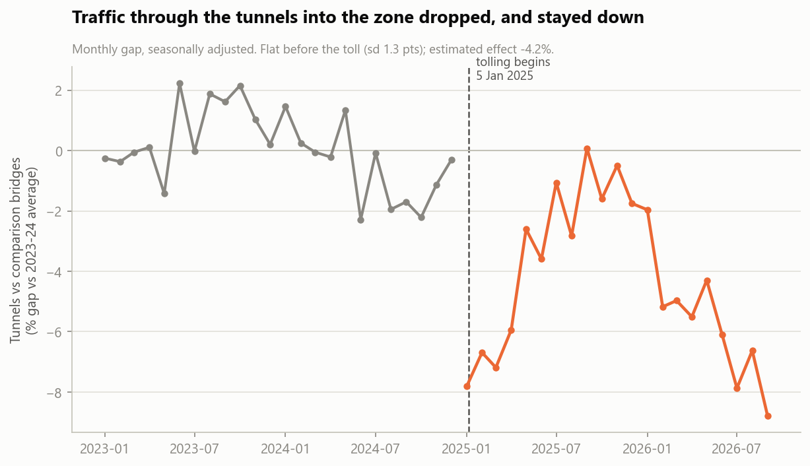
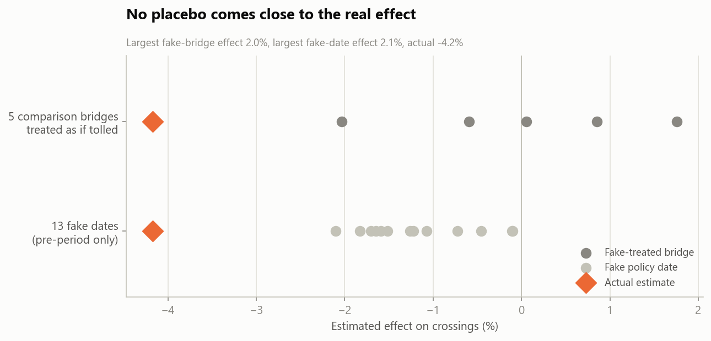
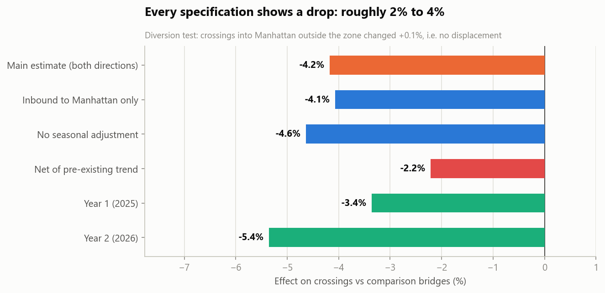
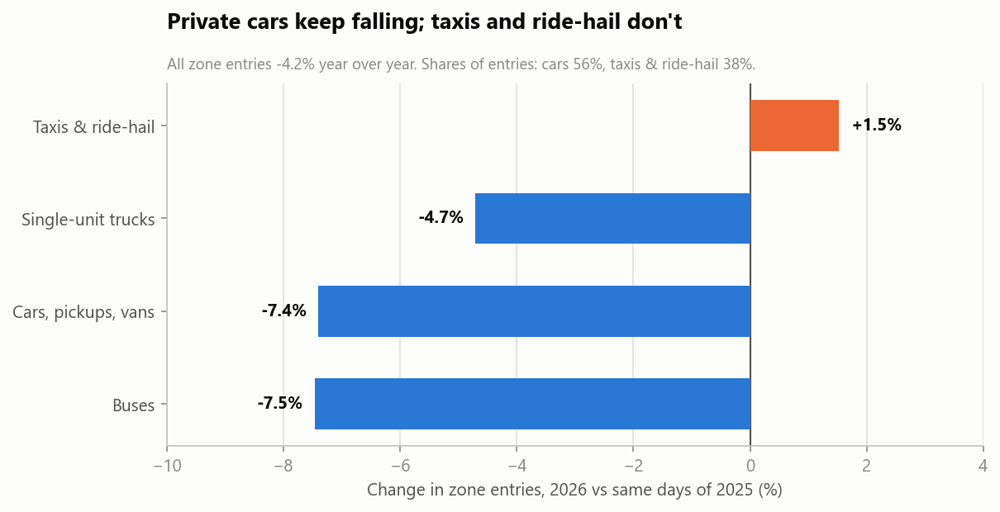

# NYC Congestion Pricing: A Natural Experiment

**Did tolling Manhattan below 60th Street reduce traffic?** A difference-in-differences study using MTA bridge and tunnel crossings, with permutation inference and an explicit pre-trend check.

```bash
pip install -r requirements.txt
python verify.py
```

Rebuilds every estimate from the MTA data and asserts all 10 published figures. About 5 seconds.

Read [MEMO.md](MEMO.md) for the findings.

---

## Headline findings

- **Tunnel traffic into the zone fell 2–4%** relative to comparable MTA bridges after tolling began on 5 Jan 2025: −4.2% standard estimate, −2.2% net of a pre-existing trend.
- **No placebo comes close.** The largest effect from a fake-treated bridge is 2.0%, and from a fake policy date 2.1%.
- **No displacement.** Crossings into Manhattan outside the zone were unchanged (+0.1%).
- **No sign of fading.** −3.4% in year 1, −5.4% in year 2.
- **Private cars keep falling (−7.4%) while taxis and ride-hail don't (+1.5%)**, 2026 compared with 2025.









## Design

| | Facilities | Why |
|---|---|---|
| **Treated** | Hugh L. Carey Tunnel, Queens-Midtown Tunnel | Deliver traffic directly into the zone |
| **Comparison** | Verrazzano, Throgs Neck, Whitestone, Cross Bay, Marine Parkway | Same toll system, never touch Manhattan |
| **Tested for diversion** | RFK Bridge, Henry Hudson Bridge | Reach Manhattan outside the zone, so they could absorb diverted trips |

- **Estimator:** two-way fixed effects on log daily crossings over a balanced 1,342-day panel.
- **Seasonal adjustment:** each crossing's calendar-month pattern is removed using pre-period data only. Two comparison bridges serve the Rockaway beaches and surge every summer.
- **Inference:** permutation. The estimate is recomputed treating each comparison bridge as tolled, and on 13 fake policy dates.
- **Pre-trend:** a linear trend fitted to the pre-period gap and projected forward gives the lower bound of the range.

## What's in `src/`

| Script | Does |
|---|---|
| `fetch_data.py` | Pulls daily aggregates from NY Open Data's Socrata API, with the window pinned for reproducibility |
| `analysis.py` | Difference-in-differences, robustness checks, permutation tests, event study, diversion test, zone-entry mix, transit |
| `charts.py` | Four charts |

## Data

MTA datasets published on [New York State Open Data](https://data.ny.gov):
- [Bridges and Tunnels Hourly Crossings: Beginning 2019](https://data.ny.gov/d/ebfx-2m7v), aggregated to daily totals
- [Congestion Relief Zone Vehicle Entries: Beginning 2025](https://data.ny.gov/d/t6yz-b64h)
- [Daily Ridership and Traffic: Beginning 2020](https://data.ny.gov/d/sayj-mze2)

The daily extracts (about 12 MB) are included and hash-pinned. `fetch_data.py` recreates them.

## Requirements

Python 3.10+, `pandas`, `numpy`, `matplotlib`.

## Limitations

- Covers MTA tunnels only. The Lincoln and Holland tunnels and the free East River bridges aren't in this data.
- Tunnel users receive a credit against the zone toll, so the net price increase here is smaller than at other entry points.
- The trend-adjusted bound assumes the late-2024 drift would have continued linearly.
- Subway figures are descriptive, not causal.

## License

Code is released under the MIT License (see [LICENSE](LICENSE)). The data belongs to its original publishers and keeps its original license; see the sources above.
